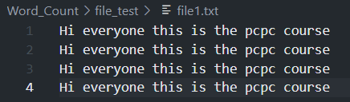
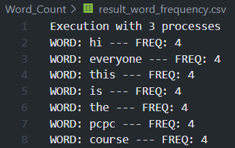
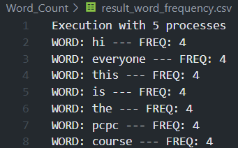
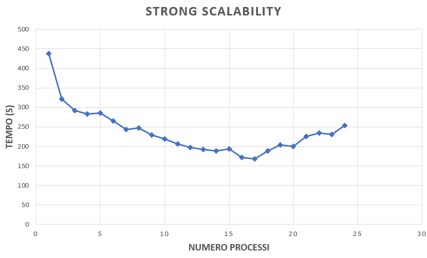
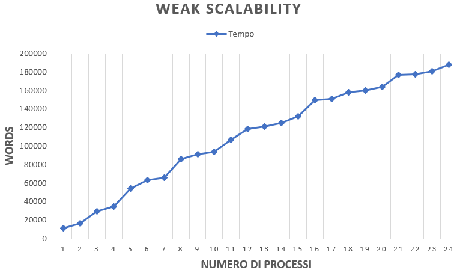

# MPI WORD_COUNT PCPC PROJECT 2021/2022

|Studente|Matricola|Numero Progetto|
|:---:|:---:|:---:|
|**Marco Delle Cave**|0522501162|01162 % 5 = 2|

# Problem Statement
Il problema Word_Count consiste nel leggere un numero casuale di parole all'interno di un numero variabile di file, con lo scopo di contare quante volta una singola parola si ripete all'interno dello stesso file e tra più file. Nello specifico, il tutto si realizza attraverso i principi della programmazione parallela, quindi ogni processo coinvolto ha una porzione di file da analizzare, per poi comunicare il proprio risultato ad un singolo processo MASTER.
Il problema è stato scomposto in 3 sottoproblemi:
- Partizionamento in modo equo del numero totale di parole presenti all'interno dei file, facendo in modo che ogni processore legga lo stesso numero di parole, o al massimo nel caso di divisione con resto, una parola in più.
- Ogni processo crea un proprio istogramma locale, eseguendo il conteggio delle parole all'interno della propria porzione di file. Nel caso di parole che si ripetono più volte, si procede con l'aggiornamento del campo frequency relativo a quest'ultime.
- Ogni processo comunica il proprio istogramma locale al processo MASTER, il quale effettua un merge col proprio istogramma al fine di crearne uno globale.

# Scelte progettuali fatte

Per la creazione degli istogrammi si è fatto uso di una linked list, in grado di gestire le parole rilevate in ogni file con le rispettive frequenze associate. La struct è molto semplice, ed ognuna di esse è collegata alla successiva all'interno della lista. Sono stati realizzati metodi per scorrere la lista, inserire un nuovo elemento all'interno della lista, aggiornare le frequenze relative alle parole ed altri metodi di supporto.

La struct è cosi definita:

```
struct Word
{
  char *word;
  int word_frequency;
  struct Word *pNext;
};
```

```
/*Aggiungi una nuova parola all'istogramma, o aggiorna la relativa frequenza */
void addWordToList(char *word);

/*Crea un nuovo item all'interno dell'istogramma */
struct Word* createWord(char *word, int number);

/*Stampa il contenuto di un item specifico */
void showStructInfo(struct Word *pWord,int rank);

/*Restituisci il numero di parole non duplicate presenti all'interno di un istogramma */
int counter_non_duplicate_words();

/*Restituisci la lunghezza della parola corrente */
int lengthOfCurrentWord(struct Word *pWord);

/*Restituisce la frequenza relativa ad una parola*/
int returnWordFrequency(struct Word *pStruct);

/*Restituisce la parola correntemente puntata */
char* returnWord(struct Word *pWord);

/*Metodo esclusivo per il processo MASTER, utilizzato per fare il merge degli istogrammi locali dei vari processi con il proprio */
void addOrIncrWordInMaster(char *word, int count);

```

**La sezione seguente illustrerà le soluzioni ai tre sottoproblemi descritti sopra:**

# Partizionamento delle word
La prima cosa di cui abbiamo bisogno è sapere il numero totale di parole nell'insieme di file. Per fare ciò è stata fatta una lettura all'interno di ogni singolo file, aggiornando un counter per ogni parola trovata. Ogni parola termina alla presenza di un \n, \t ecc.

**Partizionamento [MASTER]**
Una volta ottenuto il numero totale di parole, la partizione viene calcolata in base al numero di processori coinvolti ad eseguire il lavoro. La partizione è espressa come una divisione, senza considerare la parte decimale. Una volta calcolata, si è gestito l'eventuale resto, per capire quali processi devono gestire una parola in più rispetto alla loro partizione (il resto è sempre compreso tra 0 e il numero di processori n -> 0 <= r <= n)
Dopo aver calcolato la partizione per ciascun processo, il master invia agli slave la partizione, il resto ed altre informazioni, come l'elenco dei nomi dei file e il numero di parole contenute in ciascuno di essi.
A questo punto il master inizia il lavoro sulla propria partizione. D'ora in poi possono verificarsi due casi:
1)Il primo file ha meno parole della partizione, quindi è necessario leggerlo tutto e continuare con il file successivo.
2)Il primo file ha più parole della sua partizione, quindi è necessario leggere al massimo un numero di parole pari alla partizione.

**Partizionamento [SLAVE]**
Per quanto riguarda gli slave è necessario indicargli anche la parola da cui devono iniziare ad eseguire il conteggio. Di conseguenze occorre capire da quale file leggere e da quale posizione all'interno di quest'ultimo partire con il conteggio, poichè il processo precedente potrebbe non aver letto tutto il file, ma solo una piccola parte.
Per questo motivo ogni slave calcola il proprio lowerbound, ovvero da quale parole dovrebbe iniziare a leggere. Questa operazione è stata fatta attraverso semplici calcoli:

```
 if(resto != 0){ 
            if(rank < resto){
                lw_bound = (partition + 1) * rank;
                partition++;
            }
            else {
                lw_bound = (partition*rank) + resto;
            }
        } else { 
            lw_bound = partition * rank;
        }

```
Una volta calcolato il proprio lowerbound, ogni slave sa esattamente la posizione esatta da cui iniziare il proprio conteggio.
Ci sono diversi steps:
1) Occorre identificare esattamente quale file leggere. Per farlo si è fatto uso di una variabile che viene incrementata del numero di parole nell'i-esimo file nel ciclo. Quando questa variabile supera il lowerbound calcolato, allora può iniziare il conteggio.

```
int size = sizeof(number_of_word)/sizeof(number_of_word[0]);

for(int i=0; i < size; i++){

  cum_sum += number_of_word[i];

   if((cum_sum > lw_bound) && (partition > 0)){
     ...

    //Questo è il file che stiamo cercando     
     ...
  
   }
}

```
2) Una volta trovato il file da cui iniziare il conteggio, occorre capire se questo file è stato letto per intero dal processo precedente o contiene ancora parola da leggere. Per fare ciò si utilizza una variabile "start", il cui valore si ottiene sottraendo al numero di parole contenute nel file corrente, la differenza tra la somma cumulativa di parole tra i vari file e il lowerbound. La variabile start può assumere due valori: se è minore di 0, significa che il file corrente deve essere letto dall'inizio, altrimenti il suo risultato è esattamente il punto da cui iniziare la lettura. Ad esempio, se start è pari a 100, il processo p inizierà a leggere dalla 101-esima parola.

```
start_to_read = number_of_word[i] - (cum_sum-lw_bound);
            
            if(start_to_read < 0){
                        start_to_read = 0;
                    }
            ...


```

# Conteggio locale delle parole

La soluzione che si è deciso di utilizzare per il conteggio delle parole è abbastanza semplice, ovvero ogni volta che viene raggiunta la fine di una parola, quest'ultima viene copiata all'interno di un array temporaneo per poi essere aggiunta alla linked list (se non già presente al suo interno). Ad ogni parola trovata l'array viene ripristinato in modo tale da essere riutilizzato per la parola successiva.

```
else {
    if((ch == ' ' || ch == '\t' || ch == '\n') && (flag_in_word==1)){
       
       //Una volta raggiunta la fine di una parola
       
       word_counter++;
       flag_in_word=0;                                
       if(word_counter > start_to_read){
             partition--;
             temporary_word[index_of_tmpword] = '\0';
             index_of_tmpword++;
             addWordToList(temporary_word);
             memset(temporary_word,0,100);
             index_of_tmpword = 0;
       }                            
        
        if(partition <= 0){
              break;
        }
    }
}


```
A questo punto ogni processo ha generato il proprio istogramma locale ed è pronto per comunicarlo al master (comunicare le parole e le relative frequenze al master).

# Comunicazione degli istogrammi locali al MASTER

Per consentire ad ogni processo slave di comunicare il proprio istogramma (linked list) al master, l'approccio che ho utilizzato è quello di inserire all'interno di un array l'insieme di tutte le parole rilevate da ciascun processo, ognuna di esse separata dal carattere \0. Lo stesso principio è stato applicato per le frequenze relative ad ogni parola, al fine di sincronizzare i due array nel processo master e dunque riuscire a ricostruire la linked list.

```
//Array contenente le frequenze associate a ciascuna word

readed_non_duplicate_words = counter_non_duplicate_words();
counters = malloc(sizeof(int)*readed_non_duplicate_words);

//Array contenente tutte le parole presenti in ogni istogramma locale dei processi slave

pStruct = pStart;
        while(pStruct != NULL){
            readed_num_char += lengthOfCurrentWord(pStruct);
            pStruct = pStruct -> pNext;
            fflush(stdout);
        }
histogram_word = calloc(readed_num_char,sizeof(char));

```
Ora possiamo iniziare la comunicazione con il master. Per fare ciò ho utilizzato la primitiva di comunicazione Gatherv, per la quale il processo MASTER calcola i due parametri necessari a questa funzione,i displacement e la size, sia per l'array counters delle frequenze, sia per l'array histogram_word per le parole, per poi inviarli a tutti gli altri processi slave attraverso la primitiva Scatter.
N.B. il master non partecipa al calcolo dei due parametri, quindi quest'ultimi sono stati settati a 0.

```
if(rank == 0){

for (int i = 0; i < world_size; i++){

        if(i == 0){
            total_counters_disp[i] = 0;
        }
        else {
            total_counters_disp[i] = total_counters_disp[i-1] + recvs_allFreq_ndWord[i-1];
        }
        num_count += recvs_allFreq_ndWord[i];
    }

        for (int i = 0; i < world_size; i++){
        if(i == 0){
            result_word_disp[i] = 0;
        }
        else {
            result_word_disp[i] = result_word_disp[i-1] + recv_all_num_char[i-1];
        }
        num += recv_all_num_char[i];
        }

        int size_tcount = sizeof(total_counters_disp)/sizeof(total_counters_disp[0]);
        int size_rword = sizeof(result_word_disp)/sizeof(result_word_disp[0]);

        MPI_Scatter(&total_counters_disp,size_tcount,MPI_INT,&total_counters_disp,size_tcount,MPI_INT,0,MPI_COMM_WORLD);
        MPI_Scatter(&result_word_disp,size_rword,MPI_INT,&result_word_disp,size_rword,MPI_INT,0,MPI_COMM_WORLD);

  }      

```
Ora può avere inizio la comunicazione:

```
MPI_Gatherv(histogram_word,readed_num_char,MPI_CHAR,result_word,rcv_count_rword,result_word_disp,MPI_CHAR,0,MPI_COMM_WORLD);

MPI_Gatherv(counters,readed_non_duplicate_words,MPI_INT,total_counters,rcv_count_tcounters,total_counters_disp,MPI_INT,0,MPI_COMM_WORLD);

```
# Merge dei risultati all'interno dell'istogramma del MASTER

Avendo a disposizione gli istogrammi locali di ogni processo slave, a questo punto è possibile ricostruire la linked list e fare il merge con quella del master.

```
for(int n = 0; n < num; n++){
          if(result_word[n] == 0){
                
            addOrIncrWordInMaster(tmp_word,total_counters[count_parole]);
            memset(tmp_word,0,100);
            index_of_word_count = 0;
            count_parole++;
            }
          else 
            {
            tmp_word[index_of_word_count] = result_word[n];
            index_of_word_count++;
            }
        }

```
Il metodo addOrIncrementInMaster prende in input una parola e capisce se il master la possiede già all'interno del suo istogramma, se è cosi allora somma la sua frequenza relativa a quella parola con quella dello slave, prelevando la frequenza dall'array dei conteggi. Viceversa, se il MASTER non possiede la parola, la deve aggiungere al proprio istogramma inserendo come frequenza quella rilevata localmente dagli slave nei loro istogrammi locali.


# Correttezza

Per dimostrare la correttezza dell'algoritmo sono state effettuate tre esecuzioni, dove in ognuna di esse è stato cambiato il numero di processi coinvolti. Come si può osservare dalle immagini sottostanti, nonostante la variazione del numero di processi vengono prodotti sempre gli stessi risultati.

*File di input - Numero Processi = 1*          | *File di output - Numero Processi = 2*
:-------------------------:|:-------------------------:
      | 

*File di input - Numero Processi = 3*          | *File di output - Numero Processi = 3*
:-------------------------:|:-------------------------:
      | 

*File di input - Numero Processi = 5*          | *File di output - Numero Processi = 5*
:-------------------------:|:-------------------------:
      | 

# Benchmarking

L'algoritmo è stato testato in termini di **strong scalability** e **weak scalability** su **Google Cloud Platform** su un cluster di 6 macchine **e2-standard-4**, ognuna dotata di 4 vCPUs, quindi per un totale di 24 vCPUs.

⚠️ **IMPORTANTE: il tempo rappresentato all'interno dei grafici sottostanti non considera la parte intera, che è pari a 0 per ogni risultato ottenuto**

# Strong Scalability - 500k words

|vCPUs|Tempo(s)|Speed-up|
|:---:|:---:|:---:|
|1|0.438|1|
|2|0.321|1.36|
|3|0.292|1.5|
|4|0.283|1.54|
|5|0.286|1.53|
|6|0.265|1.65|
|7|0.243|1.80|
|8|0.247|1.77|
|9|0.230|1,90|
|10|0.219|2|
|11|0.206|2.12|
|12|0.198|2.21|
|13|0.192|2.28|
|14|0.189|2.31|
|15|0.194|2.25|
|16|0.172|2.54|
|17|0.168|2.60|
|18|0.188|2.46|
|19|0.204|2.14|
|20|0.200|2.19|
|21|0.226|1.93|
|22|0.234|1.87|
|23|0.231|1.89|
|24|0.254|1.72|





Il benchmark mostra che più processi vengoo utilizzati, minore è il tempo necessario per completare il task. Da un certo punto in poi la riduzione del tempo di esecuzione inizia a diminuire, in particolare da 18 processi in su inizia a risalire, il chè significa che l'algoritmo inizia a perdere di efficienza, principalmente per l'overhead causato dalle comunicazioni tra i vari processi.

# Weak Scalability

Le parole in input a ciascun processo hanno un rapporto di 15000:1.
|vCPUs|Tempo(s)|N-Words|
|:---:|:---:|:---:|
|1|0.011|15k|
|2|0.016|30k|
|3|0.029|45k|
|4|0.034|60k|
|5|0.054|75k|
|6|0.063|90k|
|7|0.065|105k|
|8|0.086|120k|
|9|0.091|135k|
|10|0.093|150k|
|11|0.106|165k|
|12|0.118|180k|
|13|0.120|195k|
|14|0.125|210k|
|15|0.131|225k|
|16|0.149|240k|
|17|0.151|255k|
|18|0.158|270k|
|19|0.159|285k|
|20|0.164|300k|
|21|0.176|315k|
|22|0.177|330k|
|23|0.180|345k|
|24|0.187|360k|




Come si può evincere dai risultati raccolti, il tempo di esecuzione aumenta (anche se di poco) costantemente all'aumentare del numero dei processori.

# Commento dei risultati ottenuti

Come si può notare dalle tabelle riassuntive e dai grafici, lo speed-up con l'utilizzo di 2 processori è quello che più si avvicina allo speed-up ideale. Questo significa che in queste condizioni l'algoritmo parallelo è più veloce in rapporto alle risorse utilizzate (in termini di comunicazione) e quindi più efficiente.
All'aumentare del numero dei processori lo speed-up si allontana sempre più da quello ideale comportando, quindi, una perdita di efficienza. 
Nonostante aumenti il numero di processori a disposizione il parallelismo dell'algoritmo non viene sfruttato a pieno.

# Istruzioni per l'esecuzione

⚠️ **Per eseguire il programma la directory file_test deve essere posizionata all'interno della stessa directory in cui si trova il file .c**


    📁 Word_Count    
        📝 word_count.c
            📁 file_test
             📝 file1.txt
             📝 file2.txt
                ....

Compilazione:
```
mpicc word_count.c -o word_count

```

Esecuzione locale:
```
mpirun --allow-run-as-root <np> word_count

```

Esecuzione sul cluster:
```
mpirun --allow-run-as-root <np> --hostfile <host> word_count

```
Occorre sostituire **np** con il numero di processori da utilizzare e
**host** con il path dell'hostfile.
